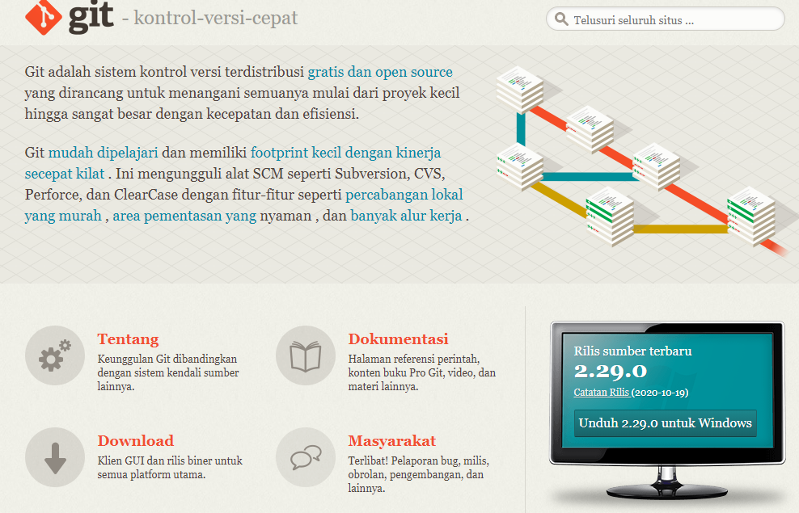
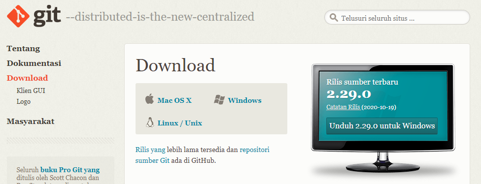
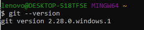
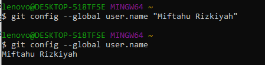
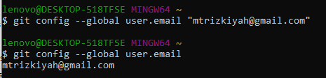
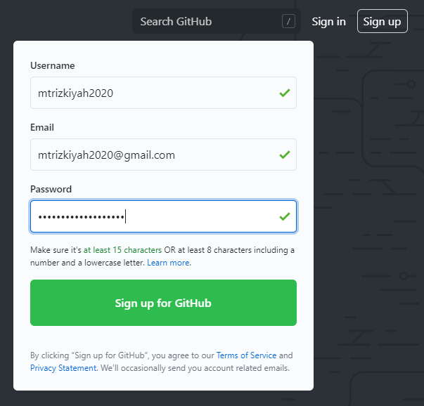
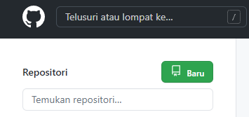
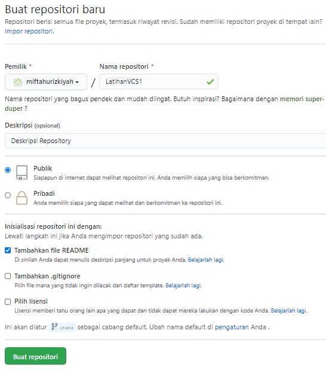
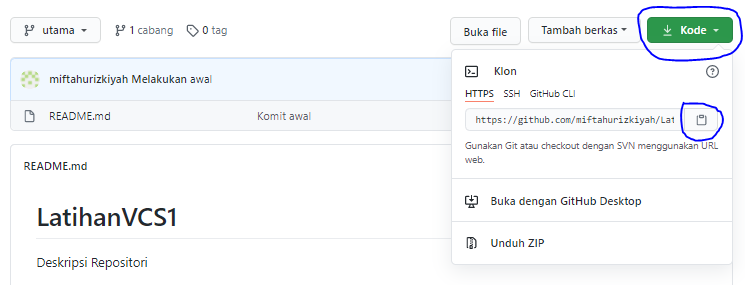

# LatihanVCS
Repository ini dibuat untuk memenuhi tugas pertemuan 4 bahasa pemrograman

Nama : Miftahu Rizkiyah 
NIM  : 312010014 
Kelas: TI.20.B.1 
Tugas: Bahasa Pemrograman Part 4 

## Langkah-Langkah Penggunaan Git / VCS

* Langkah pertama silahkan download Aplikasi Git pada link berikut ini : [https://git-scm.com/downloads](https://git-scm.com/)  
 
Pada halaman ini silahkan klik **Download** 
 
Setelah klik Tombol Download, akan muncul halaman *Download Page*, kemudian klik **Windows**

* Langkah kedua, setelah git terunduh, lakukan installasi Aplikasi Git. Dengan mengikuti langkah-langkah pada halaman web berikut. Link Referensi : [Jurnal Web - Installasi Git](https://www.jurnalweb.com/cara-menginstall-git-di-windows/)  

* Setelah langkah-langkah installasi Git pada windows selesai, langkah berikutnya cek git tersebut berjalan atau tidak. Dengan membuka Aplikasi **Git Bash** pada menu Windows, kemudian mengetikkan perintah : *git --version*  
Seperti gambar dibawah ini :  

* Pengecekan Git Version telah berhasil, saat ini waktu untuk mengkonfigurasi Username dan Email pada Git. Langkah Pertama setting/konfigurasi Username terlebih dahulu, dengan mengetikkan perintah berikut pada Git Bash : *git config --global user.name "Masukkan Nama Anda disini"*  
Untuk mengecek apakah username berhasil di konfigurasi atau belum, bisa menggunakan perintah berikut : *git config --global user.name"* Seperti gambar dibawah ini.  

* Setelah melakukan konfigurasi pada username, hal yang sama dilakukan untuk mengkonfigurasi git email. Untuk mengkonfigurasi awal dengan menggunakan syntax : *git config --global user.email "masukkan email disini"*. Dan untuk mengecek status konfigurasinya bisa mengetikkan syntax : *git config --global user.email*

* Konfigurasi pengguna di Git telah selesai dilakukan, langkah selanjutnya adalah membuat Akun Github.  
Untuk membuatnya bisa menggunakan Link berikut : [GitHub Sign Up](https://github.com) 

* Setelah akun github selesai dibuat, saatnya membuat Repositori, dengan mengikuti langkah2 berikut. Klik Baru / New Repository. 

* Isi kolom-kolom yang tersedia, dan jangan lupa untuk mencentang *Tambahkan file README.md*. 

* Setelah repositori berhasil dibuat, copy link repository agar bisa di remote di lokal PC. Lihat seperti gambar dibawah ini : 

* Buka file explorer dan pilih satu folder agar repositori bisa di clone/diunduh di lokal PC. Kemudian klik kanan pada halaman kosong dalam folder tersebut dan pilih *Git Bash Here*. 
